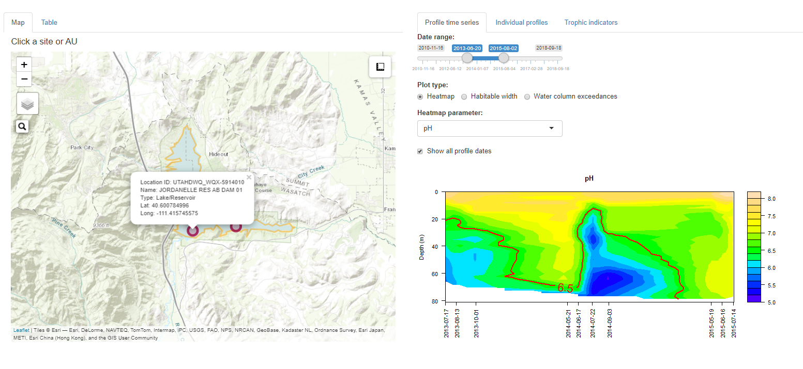

----

# R packages
As part of my work work for Utah DWQ, I've served as the lead developer for two R packages. I'm a wildly un-creative namer of tools, so these are just called wqTools, a package 
of general purpose tools related to water quality analyses, and irTools, a package of tools for use in Utah's statewide water quality assessments and Integrated Reports.  
  
These packages continue to grow and develop as new users and use cases spark new ideas for useful tools.  

## wqTools
wqTools is a collection of R tools developed and designed for use by Utah Division of Water Quality staff to expedite water quality analyses. 
This includes functions for reading data from EPA's water quality portal & EPA ECHO, assigning spatial compenents of water quality standards to sample locations, generating 
study maps, performing unit conversions, generating plots, and other tools designed to support water quality analyses.
  
This package is in active development and available via the [wqTools GitHub repository](https://github.com/utah-dwq/wqTools){target="_blank"}.

## irTools
irTools is a collection of R-tools developed by Utah Division of Water Quality to enhance and automate Utah's Integrated Report (i.e. IR) on water quality. 
The package includes tools for downloading data from EPA's Water Quality Portal and Attains, prepping raw data for water quality assessments, 
and performing and reporting on water quality assessments. It also includes a handful of 
  
This package is in active development and available via the [wqTools GitHub repository](https://github.com/utah-dwq/irTools){target="_blank"}.

----

<br>
<br>

# Analytical documents
I am a big fan and heavy user of the markdown based R packages, rmarkdown and bookdown. I use markdown and bookdown documents to document my analytical process, communicate and share my findings, and develop user guides and training materials. 
Below are a few examples of documents I've generated.

<br>

### Salinity in Great Salt Lake
An analysis of changes in salinity in Great Salt Lake in response to changes in hydrologic connectivity through a railroad causeway that bisects the lake.  
[Full document](https://bookdown.org/jakevl/gsl-sac1-figs/){target="_blank"}
<iframe src="figures/gsl_sal_ts.html" style="height:400px;width:800px;border: none"></iframe>  
<br>

### Demo of Utah DWQ's R packages
A little out of date, but useful background.  
[Full page](https://bookdown.org/jakevl/utah-dwq-demo/){target="_blank"}
<iframe src="https://bookdown.org/jakevl/utah-dwq-demo/" style="height:400px;width:800px;border:  1px solid black"></iframe>  
<br>

### Presentation on R tools at Utah DWQ
[Full page](https://bookdown.org/jakevl/utah-dwq-open-source/){target="_blank"}
<iframe src="https://bookdown.org/jakevl/utah-dwq-open-source" style="height:400px;width:800px;border:  1px solid black"></iframe>  

----

<br>
<br>

# Interactive applications

## Utah Lake Data Explorer
Analyze and visualize water quality data in Utah Lake. This application was built to support the development of nutrient water quality standards in Utah Lake as part of the 
[Utah Lake Water Quality Study](https://deq.utah.gov/water-quality/utah-lake-water-quality-study){target="_blank"}.  
  
[View on the DWQ Shiny apps server](https://udwq.shinyapps.io/UtahLakeDataExplorer/){target="_blank"}  
[Source code](https://github.com/utah-dwq/UtahLakeDataExplorer){target="_blank"}  

```{r, echo=F, fig.align="center"}
knitr::include_graphics('images/utah-lake.png')
```
<br>

## Utah's Lake Dashboard
This application is designed to interactively visualize lake profile & trophic indicator data collected by DWQ and cooperators and provide a platform for performing and 
reviewing water quality assessments based on lake profile data.  
[View on the DWQ Shiny apps server](https://udwq.shinyapps.io/lakedashboard/){target="_blank"}  
[Source code](https://github.com/utah-dwq/irTools/tree/master/inst/lakeDashboard)
```{r, echo=F, fig.align="center"}

```
<br>

## Utah's Water Quality Data Dashboard
Draft application for analyzing and visualizing water quality data in Utah and generating analytical reports. Currently embedded within the [wqTools package](https://github.com/utah-dwq/wqTools).  
  
To run, install wqTools package from GitHub and call the application:
``` {r, eval=F}
install.packages('devtools') #if not already installed
devtools::install_github('utah-dwq/wqTools')
wqTools::wqDD()
```

```{r, echo=F, fig.align="center"}
knitr::include_graphics('images/wqdd1.png')
knitr::include_graphics('images/wqdd3.png')

```

----


